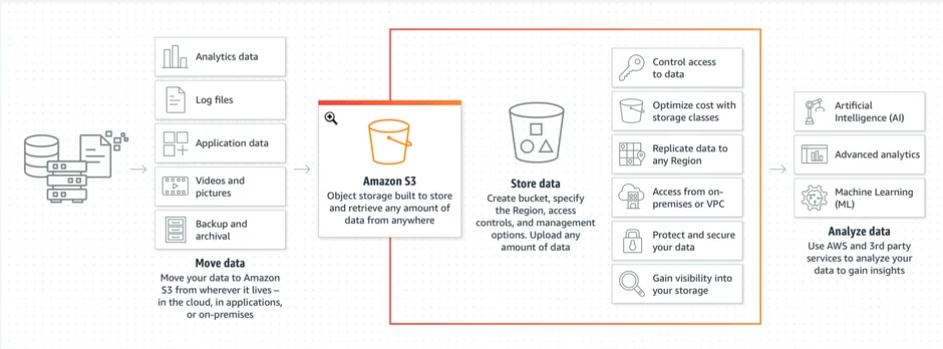

# Deployment

## Container and Deployment Overview

A **container** is a running piece of software that bundles code along with all of its dependencies, including system tools, libraries, or configuration files. Building your application in a container allows the application to run consistently in any environment, whether that environment is another computer's operating system or cloud deployment.

**Deployment** is the process of making an application run in the production environment. Deployment can be done manually or can be automated. Kubernetes is a container orchestration system that automates container deployment, scaling, and management and will be used in this course.

Two ways of bundling an application with its environment and dependencies are:

Containers and
Virtual machines (VMs).

### What is a Container?

OS level virtualization allows us to run multiple isolated processes in parallel. A container is an isolated process that consists of the following items, all bundled into one package:

- the application code,
- the required dependencies (e.g. libraries, utilities, configuration files), and
- the necessary runtime environment to run the application.
  Each container is an independent component that can run on its own and be moved from environment to environment.

### Benefit of Containers

- Containers make it easier for developers to create, deploy, and run applications on different hardware and platforms, quickly and easily.
- Containers share a single kernel and share application libraries.
- Containers cause a lower system overhead as compared to Virtual Machines.
  How to create containers?
  Several platforms (called Container runtime/engines) allow us to create containers. Some common Container runtime/engines are:

- Docker - A standardized packaging format for diverse applications
- CRI-O - Lightweight container runtime for Kubernetes
- OpenVZ - Open source container-based virtualization for Linux
- Containerd - Container runtime with an emphasis on simplicity, robustness, and portability
- Rkt - An application container engine developed for modern production cloud-native environments
- LXC and LXD - A distro and vendor-neutral environment for the development of Linux container technologies
  Docker is the most popular one and hence, in this course, you will learn to create containers using the Docker engine.

### Containers vs VMs


#### What is a VM?

A VM is like a complete computer, with its own copy of an operating system and virtual hardware. Just as with containers, a single physical machine (the host machine) can run many virtual machines to scale the number of isolated applications. While virtual machines work well for scaling applications, since they virtualize an entire machine, they can be resource-intensive. This is where containers can be an improvement.

- **How multiple VMs are managed on a host machine?**
  Each VM has a complete OS, and multiple VMs can run on the same host. The host operating system runs the VMs using a hypervisor, which is special software that creates and manages the VMs. The hypervisor maintains the isolation of the VMs with each other.
- **How multiple containers are managed on a host machine?**
  Containers bundle together an application with its dependencies. Unlike VMs, containers do not have a separate OS or virtualized hardware. They share a single operating system kernel. In practice, the containers are managed by a container manager, which serves a role analogous to the hypervisor in a VM scenario.

#### How to create VMs?

If you want to create a VM (a complete computer) locally, you can use either of the following software (called Hypervisors):

- Microsoft Hyper-V
- Oracle VM VirtualBox
- VMWare
- Parallels Desktop
  We will not get into the details and types of hypervisors because it is beyond this course's scope. Also, most of the cloud service providers offer you to create VM on their infrastructure, such as:

- AWS EC2
- GCP Compute Engines
- Azure Virtual Machines
  Creating VMs is also beyond the current course's scope, but it is important to understand the relative difference between a container and a VM.

Just as with containers, a single physical machine (the host machine) can run many virtual machines to scale the number of isolated applications.

#### Problem with VMs

Earlier, we learned that a VM is like a complete computer, with its own copy of an operating system and virtual hardware. While virtual machines work well for scaling applications, they can be resource-intensive since they virtualize an entire machine. This is where containers can be an improvement when you want to scale up your application.

#### Why containers are light-weight?

Containers run on the shared host OS instead of virtualizing an entire OS and hardware. Containers share the operating system kernel and partitioning the operating system’s resources. There are no virtual operating systems or virtual hardware in the container model, which reduces the total resources needed to run them.

#### Summary: Benefits of using Containers versus VMs

There are several benefits of using Containers over VMs:

Size: Containers are much smaller than Virtual Machines (VM) and run as isolated processes versus virtualized hardware. VMs can be in GBs while containers are in MBs.

Speed: Virtual Machines can be slow to boot and take minutes to launch. A container can spawn much more quickly typically in seconds.

Composability: Containers are designed to be programmatically built and are defined as source code. Virtual Machines are often replicas of a conventional computer system.

### Docker

Docker is the most popular open-sourced container runtime tool that helps to build, test, and run containers. It is both a container system and a company.

#### Docker Engine

- Is the software that runs docker locally.
  Docker Engine is an application that consists of a **daemon**, an **API**, and a **client**:

- The Docker daemon is a server that manages the images, containers, networks, and volumes.
- The Docker client is the user interface for Docker. The client is a CLI, so most of the work you do with Docker will take place at the command line.

#### Docker Image

A Docker image is the set of instructions for creating a container. The image typically includes a file system and the parameters that will be used for the container.

Images are comprised of multiple layers. Each layer contains specific software.

You can create a custom Docker image for a specific application. Start with a standardized parent image as the base layer. The parent image often contains the file system of a particular operating system, such as Ubuntu 18.04. Then add an additional layer to the image, on top of the base layer. You can add your application files to this additional layer. You can even add multiple additional layers, and distribute your application files across different layers, as appropriate for your needs.

You will be able to see this structure more clearly when you create Dockerfiles in the coming classroom concept.

#### Docker Container

You have already been introduced to containers, and a Docker container is just the Docker-specific implementation of the concept. In practice, Docker containers are created from Docker images - a container is a runnable instance of an image. Note that since the image is a set of instructions for creating a container, multiple containers can be created from the same image.

#### Docker Registry

Docker images can be stored and distributed using a Docker registry.

### DockerHub

DockerHub is the world’s largest registry of Docker images with more than 100,000 images available. DockerHub is the default registry for Docker. It contains images ready to run a great variety of applications.

On DockerHub, you will find images designed to run many different applications and languages. These images can be used as they are, or as you shall see in the next section, as the base for designing your own images.

e.g postgres

1. **Fetch image**
   `docker pull postgres:latest`

2. **Create and run a container**

```
docker run --name psql -e POSTGRES_PASSWORD=password! -p 5433:5432 -d postgres:latest
```

3. **Connect to the container**

```
psql -h 127.0.0.1 -p 5433 -U postgres
```

4. **Clean-up**

```
#List all containers
docker ps --all
# Stop
docker stop <container_ID>
# Remove
docker container rm <container_ID>
```

### Dockerfiles

Dockerfiles are text files used to define Docker images. They contain commands used to define a source or parent image, copy files to the image, install software on the image, and define the application which will run when the image is invoked.

In the next video, you will walk through an example of a basic Dockerfile, with a discussion of the commands found on each line.

## Deployment

#### What is Container orchestration?

To manage scaling - spinning up new container instances and shutting them down as they are no longer needed - you will use a container orchestration service. In addition to the auto-scaling of containers, the orchestration service helps balance loads, check health, and manage the container’s lifecycle (instantiating, scaling on multiple hosts, configuring, networking, and much more). There are several tools for orchestrating containers, and in this course, we will focus on Kubernetes.

#### What is a CI/CD pipeline?

A CI/CD pipeline is a set software deployment practice that automatically prepares a code and deploys it into the production environment. A pipeline includes:

- Automated code compilation
- Running tests
- Formulating a build
- Deploying the build to the target infrastructure (servers).
  Generally, a pipeline works in two stages: Continuous Integration (Build) and Continuous Delivery (Deploy). Automatically building and testing your code when changes are made is called Continuous Integration (CI). Continuous integration combined with automated deployment is referred to as Continuous Delivery (CD). Let's have a look at the quick definitions:

1. **Continuous Integration (CI)**
   There are many tools available in the industry to accomplish Continuous Integration, i.e., automated compile, test, and build processes. All these actions are performed separately from the production environment. In this lesson, we will learn to develop CI using the AWS CodeBuild service. Jenkins is another tool that is very popular for CI.
2. **Continuous Delivery (CD)**
   Once you have compiled, tested, and built the application in a development environment, you would want to deploy the application into the production environment immediately. This automatic deployment process is referred to as Continuous Delivery (CD), which is used for small incremental/frequent releases. In this lesson, we will learn to accomplish CD using the AWS CodePipeline service.
   In general, you can visualize a CI/CD pipeline having its one end associated with a shared repository containing the application code. The other end is connected to the cloud infrastructure.

### Cloud Computing Overview

#### Cloud Computing

Cloud Computing is the delivery of IT resources over the Internet. The cloud is like a virtual data center accessible via the Internet that allows you to manage:

- Storage services like databases
- Servers, compute power, networking
- Analytics, artificial intelligence, augmented reality
- Security services for data and applications

#### Characteristics of Cloud Computing

- Pay as you go - You pay only for what you use and only when your code runs.
- Autoscaling - The number of active servers can grow or shrink based on demand.
- Serverless - Allows you to write and deploy code without having to worry about the underlying infrastructure.

#### Benefits of using Cloud Computing

There are several benefits to the cloud.

- Stop guessing about capacity.
- Avoid huge capital investments up front.
- Pay for only what you use.
- Scale globally in minutes.
- Deliver faster.

#### Cloud Deployment Models

1. Public Cloud: A public cloud makes resources available over the Internet to the general public.

2. Private Cloud: A private cloud is a proprietary network that supplies services to a limited number of people.

3. Hybrid Cloud: A hybrid model contains a combination of both a public and a private cloud. The hybrid model is a growing trend in the industry for those organizations that have been slow to adopt the cloud due to being in a heavily regulated industry. The hybrid model gives organizations the flexibility to slowly migrate to the cloud.

#### Types of Cloud Computing

1. Infrastructure-as-a-Service (IaaS): The provider supplies virtual server instances, storage, and mechanisms for you to manage servers.

2. Platform-as-a-Service (PaaS): A platform of development tools hosted on a provider's infrastructure.

3. Software-as-a-Service (SaaS): A software application that runs over the Internet and is managed by the service provider.

#### Amazon Web Services (AWS) is a Market Leader

There are several popular cloud platforms like AWS, Azure, and GCP; however, Amazon Web Services (AWS) is one of the popular public cloud infrastructures. AWS routinely adds new services and invests billions of dollars in the overall platform and infrastructure.

#### Cloud-Based Products

Amazon Web Services offers a broad set of global cloud-based products.

- Analytics

  - Quick Sight
  - Athena
  - Redshift

- Application integration

  - Simple Queue Service (SQS)
  - Simple Notification Service (SNS)

- Cost management

- AWS Budgets
- Compute services

  - Elastic Cloud Compute (EC2)
  - Lambda
  - Elastic Beanstalk

- Database management services

  - MySQL
  - Oracle
  - SQLServer
  - DynamoDB
  - MongoDB

- Developer tools

  - Cloud 9
  - Code Pipeline

- Security services

  - Key Management Service (KMS)
  - Shield
  - Identity and Access Management (IAM)

- Additional Services

  - Blockchain
  - Machine Learning
  - Computer Vision
  - Internet of Things (IoT)
  - AR/VR

### Overview of AWS

#### S3 Bucket

**S3** => Simple Storage Service


S3 is a file storage system on the cloud where you can upload all kinds of data.
This files will be created as individual objects. The uploaded file get a unique id that can be used to access it.
The image above can be found at [https://aws.amazon.com/s3/](https://aws.amazon.com/s3/)

#### Elastic Cloud Compute

Elastic Cloud Compute or EC2 is a foundational piece of AWS' cloud computing platform and is a service that provides servers for rent in the cloud.

#### Identity & Access Management (IAM)

IAM is an AWS service that allows us to configure who can access our AWS account, AWS services, or even applications running in our account. IAM is a global service and is automatically available across all AWS regions.

1. IAM User
   A user is a unique identifier generated by the IAM service and recognized by all AWS services to grant access to AWS resources. A user can be a person, system, or application that requires access to AWS services. You can generate login credentials and access keys for any user in your account. Roles and policies control the scope (permissions) of a user's access to AWS resources in your account.

2. IAM Group
   A group collects IAM users with the same level of permissions to access AWS resources. You can attach or detach permissions to a group using access control policies. A group makes it easier to manage IAM users with the same level of permissions.

3. IAM Role
   A role is simply a set of policies (permissions) to access AWS services. You can assign a role either to an IAM user or an AWS service such as EC2. Creating and storing roles helps to delegate access with defined permissions without sharing long-term access keys.

Difference between an IAM role and an IAM user
An IAM user has permanent credentials that can be used to interact with AWS services directly. In contrast, an IAM role does not have any credentials; hence it cannot make direct requests to AWS services. IAM roles are assumed by authorized entities, such as IAM users, applications, or other AWS services.

4. IAM Policy
   An access control policy is a JSON file that defines the resource to grant access, level of access, and allowed actions. In simple words, a policy defines the permissions to access a resource. You can attach a policy to multiple users, groups, or roles to assign permissions to AWS resources.

AWS offers predefined policies that are managed by AWS. You can even create, save, and attach custom policies, as shown below


Create a custom policy using either a visual or a JSON editor

See a sample IAM policy that allows full EC2 access within a specific AWS region. Notice the fields that are used to define the policy: Action, Resource, Effect, and Condition.

```
{
    "Version": "2012-10-17",
    "Statement": [
        {
            "Action": "ec2:*",
            "Resource": "*",
            "Effect": "Allow",
            "Condition": {
                "StringEquals": {
                    "ec2:Region": "us-east-1"
                }
            }
        }
    ]
}
```

#### Modes of interaction with AWS?

Before we dig deeper into the AWS services, you need to know that you can create resources on the AWS cloud and interact with them (any AWS service) using either of the following modes:

| Mode of Interaction                       | Description                                                                                                                                 |
| ----------------------------------------- | ------------------------------------------------------------------------------------------------------------------------------------------- |
| Web Console                               | It is a simple browser-based GUI                                                                                                            |
| Command Line Tool (CLI)                   | It is a command-line utility to create and manage your AWS resources                                                                        |
| Integrated Development Environment (IDEs) | You can interact with AWS using the selected IDEs, in the language of your choice. It supports Java, JavaScript, Python, Go, and a few more |
| Software Development Kit (SDK)            | You can code with language-specific abstracted APIs for AWS services                                                                        |
| Infrastructure as Code (IaC)              | You can define cloud infrastructure using YAML or JSON scripts                                                                              |

### Kubernets

1. **Vertical scaling** Increasing the host machine's hardware resources on which the container is running is called vertical scaling. Earlier, we learned that a container has no resource constraints and can use as much of a given resource as the host's kernel scheduler allows. This approach's downside is that
   It is challenging to scale up-or-down as the demand changes automatically.
   Larger host machines can be more expensive than smaller machines, so it is a loss if the machine is underutilized. Also, running an application in a single container alone doesn’t leverage the full power of containerization.

2. **Horizontal scaling** Running multiple instances of the same application across multiple machines is called horizontal scaling. It is effortless to run multiple containers based on the same image.

Why is Kubernetes required?
In the last lesson, you learned to containerize your application. The containers that you created were running locally on your machine. There are limitations to containerizing applications locally, such as:

Scaling - You cannot automatically scale up-or-down the resources (number of containers) or application usage requirements based on the incoming traffic.

Updates - Assume you have manually scaled up your containers horizontally on multiple hosts. Now, develop a patch/update in your application. It will be difficult for you to update the patch in each container manually.

Elasticity - Your local computer/on-premise servers may not suffice the hardware requirements for running too many containers parallelly.

The solution to auto-scaling problems #1 and #2 above is to use the Kubernetes. The solution to problem #3 above is to use elastic (unlimited) resources on the cloud.

#### What is Kubernetes?

Kubernetes is one of the most popular orchestration system for containers developed by Google and open sourced in 2014. It can automate many of the manual operations of deployment and scaling of a containerized application. A few of the benefits of using Kubernetes (k8s) are:

The ease of scaling the container instances up or down to meet varying demands (horizontal scaling).
It can balance loads, and perform health checks.
It helps in setting-up inter-container communication (networking).
Kubernetes was born out of the lessons learned in the Scaling containerized apps at Google.

Benefits of using Kubernetes
A few more benefits of using Kubernetes are:

High availability architecture
Auto-scaling
Rich Ecosystem
Service discovery
Container health management
Secrets and configuration management The downside of these features is the high complexity and learning curve of Kubernetes.

#### Kubernets concepts

- Cluster: A group of machines running Kubernetes

- Master: The system which controls a Kubernetes cluster. You will typically interact with the master when you communicate with a cluster. The master includes an api, scheduler, and management daemon.

Nodes: The machines in a cluster. These can be virtual, physical, or a combination of both.

- Pods: It is considered as the smallest unit in a cluster. It is a logical group of containers on a node that runs a particular module/application. A pod consists of one or more containers, shared storage resources, and a unique IP address. Note that all the containers within a Pod share the namespaces and filesystem volumes. Pods are not persistent, and may be brought up and down by the master during scaling.

#### Kubernetes Cluster Architecture

1. The core of Kubernetes is the cluster. A cluster comprises several node machines for running containerized applications and a master for managing the nodes. Each node is capable of running multiple pods (a group of containers). Therefore, each node has a container runtime, such as Docker, installed on it.

2. Nodes are managed by the Master system. Each node in the cluster must have a container runtime, such as Docker.
   A given node can host multiple PODs.
3. The PODs (a logical group of containers) are running independent modules of an application. In the last lesson, it was a single container running a module.
4. The PODs are replicated across multiple nodes.

**Reliability**
In the cluster diagram shown above, each POD runs a specific module (App A, App B, App C...) of an application. Moreover, the PODs are not attached to a specific node (host). Instead, multiple nodes are hosting similar PODs. This architecture mitigates the chances of a single point of failure, and thus provides high availability. The master system brings a layer of abstraction for the external client/application.

**Service and Volumes**
All pods that are running the same application module share storage resources. Further, all the containers within a pod share the namespaces and filesystem volumes. Hence, in order to have a persistent way to store data, volumes can be attached to pods.

Whereas, in order to have a persistent way to communicate with ephemeral pods, a higher-level service abstraction is provided, called Kubernetes Service.

#### Amazon Elastic Kubernetes Service (EKS)

It is a managed Kubernetes service, that has the following offerings:

- EKS uses a control layer that runs the master nodes
- We can specify the size, type, and count of the worker nodes
- EKS allows auto-scaling (increasing-decreasing the worker node's count)
- EKS takes care of the automated back-ups, maintenance, and availability of the cluster
- Secure networks are set up automatically
- You only set up Nodes, Pods, and Services

#### AWS CloudFormation

CloudFormation is a tool for creating, managing, configuring, and deploying cloud resources. Like any other AWS service, CloudFormation can be used via either the CLI or web-console.

This tool is particularly beneficial if you have to provision a set of cloud resources multiple times, at scale. You can do so by simply writing (YAML or JSON) scripts that you can easily edit and run numerous times.

- The (JSON or YAML) script file is also called the CloudFormation template.
- In the script, we mention each resource's necessary configuration that we want to provision and then use either the CLI commands or web-console to execute the scripts.
- You can still individually manage AWS resources that are part of a - CloudFormation stack.

#### What is a CloudFormation template?

It is a YAML or JSON script that defines the collection of AWS resources that you want to create in just one command. Defining a particular resource means declaring the

- name of the resource,
- type of resource, and
- assigning the necessary properties.
  Of course, the properties of a resource vary from one type to another, for example, the properties of an IAM role will be different from an S3 bucket. Let's see an example CloudFormation template below that is defining a VPC with a 10.0.0.0/16 block (i.e., a virtual network with 65,536 private IP addresses):

```
AWSTemplateFormatVersion: 2010-09-09
Description: Udacity - This template deploys a VPC
Resources:
  myUdacityVPC:
    Type: 'AWS::EC2::VPC'
    Properties:
      CidrBlock: 10.0.0.0/16
      EnableDnsHostnames: 'true'

```

The template above is defining the following:

- default template format, as `2010-09-09`
- name of the resource, as `myUdacityVPC`
- type of resource, as `'AWS::EC2::VPC'`
- Property fields, such as `CidrBlock`, and `EnableDnsHostnames`

#### What is a stack?

When you run your CloudFormation template either using a CLI or the web-console, a group of resources gets created in the cloud. For example, the group of resources could comprise a VPC, one or more EC2 instances, S3 buckets, IAM roles, or any other AWS resource.

This collection of resources that get created using a single script, is considered a one-logical entity called a stack. It means you can create, update, or delete a stack in just a single command.

Create a stack using the CLI
Assume that the template file name is myFirstTemplate.yml, and this file is present in your current working directory locally (or navigate to the folder where this file is present). There are three basic tasks you can do:

#### Create a stack using the CLI

Assume that the template file name is myFirstTemplate.yml, and this file is present in your current working directory locally (or navigate to the folder where this file is present). There are three basic tasks you can do:

1. Create a new stack

Run the following command in the terminal, from the same directory where you've placed your myFirstTemplate.yml file:

`aws cloudformation create-stack --stack-name myFirstTest --region us-east-1 --template-body file://myFirstTemplate.yml`
In the command above,

The stack name is `myFirstTest`
The stack will be created in the `us-east-1` region
The stack is based on the template available at the path `file://myFirstTemplate.yml`

- Update an existing stack
  The command below will update the existing stack with the changes you have mentioned in your template file:

`aws cloudformation update-stack --stack-name myFirstTest --region us-east-1 --template-body file://myFirstTemplate.yml`

3. Describe an existing stack
   aws cloudformation describe-stacks --stack-name myFirstTest
   The command above will show all properties of all the resources in the stack.

4. Delete the stack
   Make it a habit to delete the cloud resources once you've finished your exercise:

aws cloudformation delete-stack --stack-name myFirstTest

#### Template Sections

Template: It is a JSON/YAML file that provides the configuration details for building your AWS infrastructure. For each resource that you wish to provision, you write the resource type and its properties. The benefit of using the templates is that they are reusable scripts, and the changes to the cloud resources can be tracked easily.

Stack: It is a logical group of related resources on AWS. It is managed as a single entity.

**Template sections**
Let’s consider another example template, mySecondTemplate.yml, given at the bottom of this page. We will create the stack first, the understand the sections in the template.

Download the template, and run the command below from the same directory where you have the template downloaded.

`aws cloudformation create-stack --stack-name mySecondTest --template-body file://mySecondTemplate.yml --region=us-east-1`
The command above will create a new stack, mySecondTest, in the us-east-1 region. The stack will create all the resources as defined in the template file.

Let's understand the various sections of the template. Note that all sections of a temple, except the `Resources` section, are optional. Also, the order of sections in a template does not matter, and importantly, fields in a particular section might refer to values from a previous section.

#### Section 1: Format Version (optional)

Recall that in the previous example, the first line of the template was:

AWSTemplateFormatVersion: 2010-09-09
If you don't specify this section, AWS CloudFormation will assume the latest template format version, 2010-09-09, and it is currently the only valid value.

#### Section 2: Description (optional)

It contains a string description of your choice. This section must always follow the template format version section. The string length can be 0 to 1024 bytes. It serves as a comment about the template.

#### Section 3: Parameters (optional)

You can think of "parameters" as "variables" used in the Resources or Outputs sections. The Parameters section declares the values that get substituted against the variables used in other sections. For example, in the snapshot below, the Parameters section has the following parameters:

- EnvironmentName
- VpcCIDR
- PublicSubnet1CIDR
- PublicSubnet2CIDR
- PrivateSubnet1CIDR
- PrivateSubnet2CIDR

#### Section 4: Resources (required)

This section is mandatory to be defined in the template. It defines the AWS resources that need to be provisioned as a part of the stack. Remember to include at least one resource (e.g., a VPC, an EC2 instance, a database) in the template, otherwise, it will give you an error when trying to run the script.

Each resource can be defined with the following fields:

Logical ID (Optional)
Type
Properties - It has further sub-fields as shown in the snapshot below. Also, the properties of a resource vary from one Type to another.
DependsOn (Optional)
DeletionPolicy (Optional)
Considering our example above, it will create the following resources:

one VPC
one InternetGateway
four subnets
two NAT gateway
three route-tables (each comprising a route and multiple associations)
It's alright if you aren't familiar with all these resources and their details. The objective here is to make you familiar with the template. You can create ANY resource the same way as explained here.

#### CodePipeline

Continuous Delivery

- Used for small incremental releases or frequent releases
- Automates code compilation, testing and packaging
- May involve human QA before final release or automated release to production
