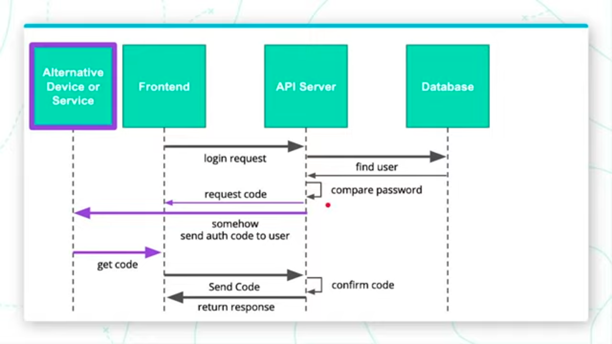
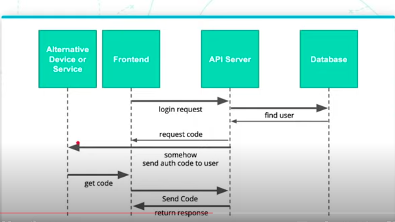

# Identity and authentication

## Common Authentication Methods

### Username and Passwords

This is the most common method of identifying users in the age of Software as a Service (Saas).


### Brief Intro to Problems with Passwords

Some issues with passwords are outside of our control as developers. Many issues come from user behavior that we cannot directly influence, such as:

- Users forget their passwords
- Users use simple passwords
- Users use common passwords
- Users repeat passwords
- Users share passwords

In contrast, some issues are within our control as developers:

- Passwords can be compromised
- Developers can incorrectly check
- Developers can cut corners

### Alternative Authentication Methods

1. **Single Sign-On**
   Single sign-on is essentially trusting someone else to answer who you are. When users log in to a platform, they can use another platform such as Google, Facebook as a single sign-on provider to authenticate their identities.

2. **Multi-Factor Authentication**
   Multi-factor authentication provides us one layer of trust on top of passwords. Essentially, it trusts that you and only you have access to something physical or sensitive and secure.

   Once the server validates the initial login request, an additional code is sent to a user's alternative device or service. The user will receive the code and send it back to the server where the code will be checked. Once the code is confirmed valid, the user's login request is allowed.

   

3. **Passwordless**
   Taking multi-factor authentication to an extreme, we have passwordless. To make the authentication passwordless, we remove the password. When a user makes a request, he only has to send the user ID and the server will then send a code to the alternative device. Then the user will use the frontend to send the code back to the server.
   

4. **Biometric Authentication**
   Biometric authentication uses a part of your body to authenticate into a system. The most commonly realized biometric authentication method is fingerprint authentication.

### Third-Party Auth Systems

There are risks associated with implementing the systems ourselves. Most of the risks lie in the backend and are developer risks.

**Monolithic architecture** is great for smaller systems where you only have a few endpoints and a few responsibilities. But it might be overwhelming to maintain and manage when the system's complexity begins to grow. Often in a monolithic service with many responsibilities, there might be interdependencies that make it difficult to change your code. It is called technical debt that might lead to mistakes and vulnerabilities.

**Microservices** take individual responsibilities and split them into smaller servers. All the systems are self-contained and minimal interaction between them is needed. But if the authentication service is embedded within each of these systems, and we change it in one system, we may have to make the change across all other systems. To solve this issue, we can create the authentication service as a microservice of its own - acting as a single self-contained system to handle everything related to authentication.

A token is a credential that is temporary and allows the frontend to remember who that person is for subsequent requests.

### JSON Web Tokens (JWTs)

Recall that users will submit information from our frond-end to a third-party authentication service such as Auth0. If the login is successful, the authentication service will return a successful result along with a token. This token will be used in subsequent requests whenever our services need to authenticate the user.

JSON web tokens (JWT) are intrinsically stateless, meaning that our server knows that this token is valid and works regardless of the state of a session. When JWT is passed to the front-end then to the server, that server only has to fetch a public key one time from the authentication service. The key will then be stored in the server to verify the JWT. Stateless also solves the problem of scalability.

### JWT - Datastructure

**Parts of a JSON Web Token**
In its raw form, a JSON web token (JWT) is just a string. Although it looks like a bunch of random letters and numbers, hidden within is actually an intuitive structure.

A JWT can be broken into three main parts: header, payload, and signature. These three parts work together to ensure that the information within the JWT is consistent and that we can validate that the information has not been changed.

**Including Data in Our JWT Payload**
The string of JWT uses an algorithm called Base64 to encode the information as well as decode the information. It is a two-way transformation between a well-formatted text and a jumbled-up-looking text.

Recall that a JWT contains three parts: header, payload, and signature.

- Payload stores specific information about the user such as a username or user ID.
- Header includes an algorithm used to sign the token such as HS256

However, since base64 is very easy to use, it raises a question if that JWT sent to our server is indeed generated by a system that we trust and the JWT is containing the authentic identity of the individual making that request.

### JWT - Validation

The signature part of the JWT will help us verify that the information in the JWT is not tampered with and comes from a trusted source. It is dependent on the header, payload, and secret. A secret is a string stored on the authentication service and on the server that will validate the JWT.

If the secret is not known by a third party, they cannot sign the information within their payload or header. If the header or payload changes and the secret remains the same, the signature will change. As a result, if the signature strings match, we can trust that the data within the JWT is authentic. But if not, we know that the information has been tampered with in transit.

### Local Storage

Local Storage is an implementation of a key-value store that is accessible through a javascript interface in most modern browsers. It is a general purpose interface to store strings which will persist in memory from session to session. It is designed for smaller strings and alternative opensource systems like localForage exist for large amounts of data.

### Storing JWTs

There could be some time before storing and getting the JWTs. But there should not be a problem as long as the JWT has not expired between the time that it was retrieved and stored and the time it was sent to the server.

To store the JWT using local storage, we use:

```javascript
jwt = response.jwt;
localStorage.setItem("token", jwt);
```

To use the JWS, we recall it from the store:

```javascript
jwt = localStorage.getItem("token");
```

### Sending Tokens with Requests

**Accessing Authorization Headers in Flask**

An authorization header is a string. It includes a keyword prepended to the JWT called bearer, which indicates what type of token is included in the authentication header. It also includes the token. Bearer and token are separated by a space.

To unpack an authorization header, we can add the following code to the `app.py`

```python
def headers():
    auth_header = request.headers['Authorization']
# get the token
    header_parts = auth_header.split(' ')[1]
    print(header_parts)
```

**Validating Auth Header Formats and Defining our Decorator**
NOTE: This step does not validate if a JWT is authentic and has not been tampered with. We'll cover those checks in Practice - Applying Skills in Flask.

We can also pass a few conditions to make sure everything is valid.

```python
def get_token_auth_header():

# check if authorization is not in request

    if 'Authorization' not in request.headers:
        abort(401)

# get the token

    auth_header = request.headers['Authorization']
    header_parts = auth_header.split(' ')

# check if token is valid

    if len(header_parts) != 2:
        abort(401)
    elif header_parts[0].lower() != 'bearer':
        abort(401)

return header_parts[1]

app = FLASK(**name**)

@app.route('/headers')
def headers():
jwt = get_token_auth_header()
print(jwt)
return "not implemented"
```

To make it as a decorator, you can use the following code.

```python
from functools import wraps
def requires_auth(f):
    @wraps(f)
    def wrapper(*args, **kwargs):
        jwt = get_token_auth_header()
        return f(jwt, *args, **kwargs)
    return wrapper

@app.route('/headers')
@requires_auth
def headers(jwt):
    print(jwt)
    return "not implemented"

```

## Passwords

### Problems with Plain Text

Transmitting and storing information such as passwords in plain text is risky because this information is not guaranteed to be secret forever.

There are many things that can go wrong with the information stored in a database.

Bad actors
Bad database passwords
Bade backup security
SQL injection
Additionally, there are risks within the API server.

Bad actors
Bad logging
Bad ORM/Serializers
Plain text password also exposes us to risks for data that in-flight between services.

Intercepted traffic
"Hotel" WIFI
Additional Reading
Facebook. In March 2019, it was revealed that over 20,000 employees had access to plain text user passwords. Thankfully, it believed there was no malice resulting from this flub up. Read More.

Large Power Utility. Discovered in February 2019. They'll conveniently even email you the plain text password. Read More

The site haveibeenpwned.com has many other documented mistakes and is worth a skim.

### Brute Force Attacks

In theory, a user can submit millions or thousands of login requests and they may guess the passwords correctly at some point. This attack is known as a brute force attack.

We can easily mitigate brute force attacks using a few techniques:

Prevent or ratelimit multiple incorrect login attempts
Do not allow common passwords
Enforce a reasonable password policy
Log and monitor for attack
An Alternative to Rate-Limiting: CAPTCHAs
Sometimes, rate-limiting or rejecting multiple requests is not the solution. One unintended consequence, for example, would be locking a legitimate user's account because it is under attack. An alternative is something known as a CAPTCHA or "completely automated public Turing test to tell computers and humans apart". A CAPTCHA is designed to be easy for a human but difficult for a machine. In this instance, a connection is flat out rejected if a "bot" or script is attempting to gain access through multiple attempts.

Until recently this was most commonly performed by asking a user to type some form of difficult to read text into an input. But, this problem is adversarial, and with advances in computer vision, these were defeated by scripts. One modern implementation of this system that can be added to your site is Google reCAPTCHA. This API produces a score from 0 to 1 of how likely the visitor is a bot based interactions with your site.

### Data Handling and Logging

**Serialization of Models**
Serialization is the process of transforming a data model into a more easily shared format. For example, this is commonly performed when sending information as a response from a server to the requesting client in the form of a JSON object.

**Logging Best Practices**
Logs help us with security for many reasons.

- Logging leaves a solid audit trail

  - Login attempts (ids)
  - Login sources
  - Requested resources
    But we should never log:

- Personally identifiable information
- Secrets
- Passwords
  You should consider your logs as sensitive data that should be held to the same level of security as the information you are storing in your database tables.
